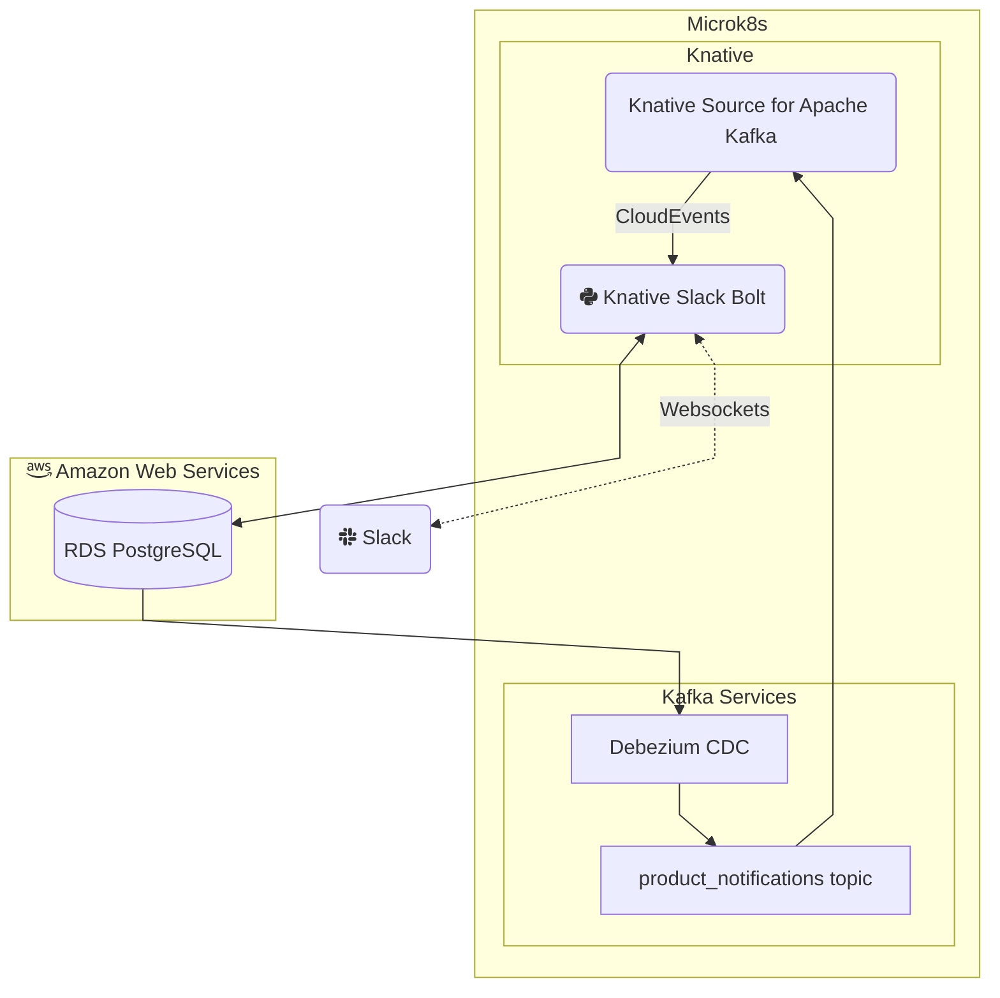

Python Slack Bolt App Webstore Inventory Tracker on Knative
======

> This project is work in progress

## Project Background

I wanted to track inventory for a handful of sites with high demand products and this Slack app the user facing portion used to select products of interest and relay stock and price change notifications.

### Inventory Tracking Scraping Services _not contained herein_

Inventory data is aquired on a scheduled basis using Prefect aataflow automation.  Prefect Cloud is usde to orchestrate flow runs which are executed by the Prefect Agent in ECS.  Up-to-date product inventory data is retained within RDS and changed trigger the creation of audit records.

### Inventory Tracking Notification and Management Services

The Inventory Tracking Notification and Management Services are backed by the same RDS instance as the scraping services.

#### Components

##### Slack Bolt App

Python Slack Bolt application that runs on Knative Serving and receives notifications via [CloudEvents](https://cloudevents.io/) from Knative Eventing's [Knative Source for Apache Kafka](https://knative.dev/docs/eventing/sources/kafka-source/#knative-source-for-apache-kafka).

This app also features the ability for Slack users to search available products and toggle notifications.

##### Knative Source for Apache Kafka

[Knative Source for Apache Kafka](https://knative.dev/docs/eventing/sources/kafka-source/#knative-source-for-apache-kafka) listens to Kafka topics and relays messages to specified sink as a Cloud Event.

##### Apache Kafka Broker

Notification event topic broker.

##### Debezium CDC Connector

Listens to change events for specific tables and sends them to the Slack Bolt App to deliver the notification.